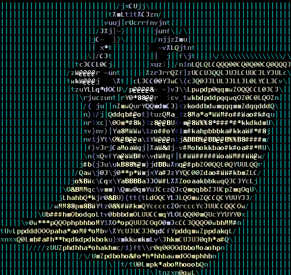

# About Me:
Reverse Engineering, Malware Analysis & Malware Development Enthusiast, Passionate in DFIR. Plays CTF during most of the weekend with [RE:UN10N](https://x.com/reun10n_)

### GitHub Stats:
 
 

## 🏆 GitHub Trophies

